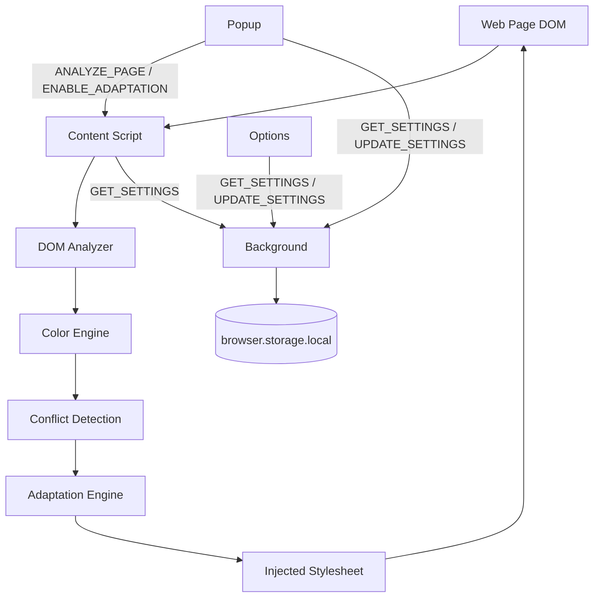

# Architecture

ColorAdapt is a WXT-based WebExtension (Manifest V3 on Chrome/Edge, MV2 on
Firefox, generated from one source tree). It has no backend: every module
below runs inside the browser, either in the background service worker, a
content script injected into the page, or an extension page (Popup/Options).

## Layering

```text
src/
  domain/          Pure types and constants. No dependencies on anything else.
  core/             Pure(ish) business logic: color math, DOM analysis,
                    conflict detection, adaptation decisions. Depends only
                    on domain/ and shared/. The DOM Analyzer and the
                    Adaptation Engine's StylesheetManager are the two places
                    core/ touches the real DOM — everything else is
                    deterministic and unit-testable without a browser.
  infrastructure/   WebExtension API access: storage, messaging, browser
                    utilities. This is the ONLY layer allowed to import
                    `wxt/browser`.
  features/         Glues core/ + infrastructure/ into something an
                    entrypoint can call: React hooks for the UI, and the
                    content-script controller that ties the DOM Analyzer /
                    Conflict Detector / Adaptation Engine together for one
                    document.
  entrypoints/      Thin WXT entrypoints (background, content script,
                    popup, options). Should contain almost no logic.
  shared/           Cross-cutting utilities/constants with no opinion about
                    domain, browser, or UI.
```

The rule that matters most: **core logic never imports React or
`wxt/browser`**, and **UI code never implements color math**. If a color
algorithm needs to change, only `core/color` changes.

## Modules

| Module                                    | Responsibility                                                                                                                                                                                        |
| ----------------------------------------- | ----------------------------------------------------------------------------------------------------------------------------------------------------------------------------------------------------- |
| Color Engine (`core/color`)               | Parse/convert/compare colors; sRGB transfer functions; alpha-composite; OKLab distance; find accessible alternatives.                                                                                 |
| Vision Engine (`core/vision`)             | Replaceable, DOM-free color vision simulation (Brettel/Viénot/Machado + approximations); pair analysis. Holds no module-level mutable state or caches (M2.R1). See `docs/COLOR_VISION_SIMULATION.md`. |
| DOM Analyzer (`core/analysis`)            | Bounded traversal of a document, resolving each element's effective foreground/background/role — see `docs/CSS_ANALYSIS.md`.                                                                          |
| Conflict Detection (`core/conflicts`)     | Decide whether a foreground/background pair is a likely problem for a vision profile.                                                                                                                 |
| Adaptation Engine (`core/adaptation`)     | Turn conflicts into a minimal set of reversible style changes; apply/restore them via one injected stylesheet.                                                                                        |
| Settings Store (`infrastructure/storage`) | The only code that knows the storage schema/keys; validates data read back from `browser.storage`.                                                                                                    |
| Messaging (`infrastructure/messaging`)    | Typed message contracts and a typed router, instead of ad-hoc strings.                                                                                                                                |
| Page Analysis / Settings (`features/`)    | Content-script controller; React hooks (`useSettings`, `usePageAnalysis`) for Popup/Options.                                                                                                          |

## Data flow — analysis & adaptation



## Messaging

See `src/infrastructure/messaging/messages.ts` for the full typed contract.
Two independent channels are used, matching what the WebExtension APIs
actually support:

- **Extension pages → Background** (`browser.runtime.sendMessage`): `GET_SETTINGS`,
  `UPDATE_SETTINGS`. Background is the single writer of settings.
- **Extension pages → Content Script of one tab** (`browser.tabs.sendMessage`):
  `ANALYZE_PAGE`, `GET_ANALYSIS`, `ENABLE_ADAPTATION`, `DISABLE_ADAPTATION`,
  `REFRESH_ADAPTATION`. Only a content script can see/modify the page DOM.

Every message is validated at the receiving end with `isColorAdaptMessage`
before being dispatched, since both `runtime.onMessage` and
`tabs.onMessage` are untyped `any` channels shared with other code.

## Adaptation lifecycle

1. Content script loads, asks Background for current settings.
2. If enabled, it runs the DOM Analyzer (bounded by
   `docs/PERFORMANCE.md`'s budget) over the page. Each element's
   effective foreground/background is resolved through ancestor
   traversal and nested opacity-group compositing (opacity dims an element
   and its descendants as one group, not per layer; `opacity` on `html`/`body`
   yields `partial`) — see `docs/CSS_ANALYSIS.md`.
3. Elements whose background could not be confidently resolved (a
   gradient/image in the visible stack) are excluded from Conflict
   Detection entirely — see `ElementDescriptor.analysisStatus`. The rest
   go through Conflict Detection for the active vision profile.
4. High/critical conflicts go through the Adaptation Engine, which computes
   a minimally-adjusted color (lightness-only) that reaches WCAG AA
   contrast.
5. Changes are applied as CSS rules in a single injected
   `<style id="coloradapt-stylesheet">`, targeting elements via a
   `data-coloradapt-id` attribute — never inline styles, never direct DOM
   mutation of content.
6. Disabling adaptation removes that one stylesheet. The page's original
   styles were never touched, so this is an exact restore.

## Why no `<all_urls>`

Content scripts/host permissions are scoped to `http://*/*` and
`https://*/*` rather than `<all_urls>`, which excludes `file://`,
`chrome://`, extension pages, etc. — surfaces ColorAdapt has no reason to
run on. See `docs/SECURITY.md`.
